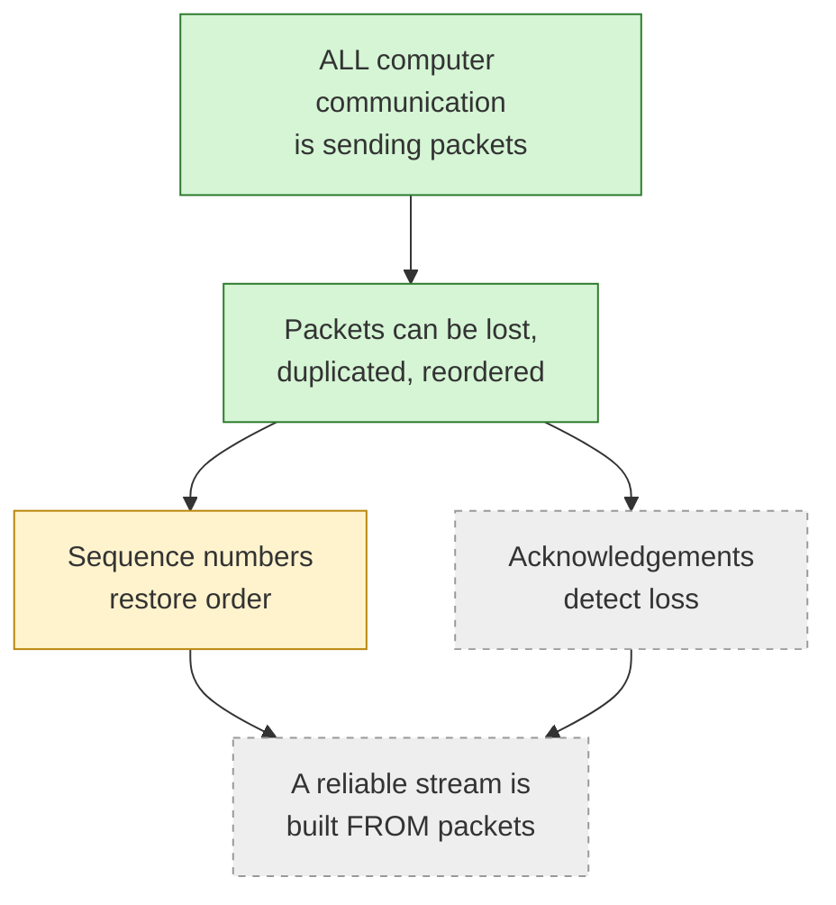

# MAP.md format

The dependency graph of what the user understands. It is the workspace's memory and the reason a later session does not start from zero: read it and you know where the frontier sits, so you probe at the edge instead of re-teaching the middle.

One map per workspace. It grows across sessions, never gets rewritten.

````markdown
# Knowledge map: <topic>

## Graph



## Nodes

| Node | Status | Depends on | Established | Evidence |
| --- | --- | --- | --- | --- |
| ALL communication is sending packets | solid | (root) | 2026-08-28 | [0001](lessons/0001-packets.md) |
| Packets can be lost, duplicated, reordered | solid | packets | 2026-08-28 | [0001](lessons/0001-packets.md) |
| Sequence numbers restore order | shaky | lossy | 2026-08-28 | [0001](lessons/0001-packets.md), missed the re-check |
| Acknowledgements detect loss | planned | lossy | | |
| A reliable stream is built FROM packets | planned | seq, ack | | |

## Frontier

<Where the edge sits right now, per strand, in one line each. This is what
the next session reads first.>

- Knows packets are lossy cold. Cannot yet say why ordering and loss need
  separate mechanisms.

## Misconceptions

<Wrong models caught during probing, and whether they were dislodged. These
matter more than gaps: a confidently held wrong belief has to be replaced,
not topped up, and it tends to grow back.>

| Misconception | Caught | Status |
| --- | --- | --- |
| Believed TCP sends a continuous stream over the wire | 2026-08-28 | dislodged in [0001](lessons/0001-packets.md) |

## Mission history

- 2026-08-28 — initial mission set.
````

## Status values

| Status | Meaning |
| --- | --- |
| `solid` | Taught and confirmed by a graded question the user got right |
| `shaky` | Taught but the check failed or was skipped. Re-establish before building on it. |
| `planned` | On the route, not yet taught |

Nothing is `solid` on the strength of having explained it. A node earns `solid` only from a graded answer.

## Rules

- **Append, do not rewrite.** History is what makes decay visible.
- **Update it during the session, not after.** A map written from memory at the end is the one that gets skipped when the session runs long.
- **A node is one idea.** If you cannot state it in a single sentence on a graph node, split it.
- **Roots have no incoming edges.** If a root turns out to derive from something simpler the user would accept at face value, push it down and add the deeper node. Never leave a mid-level fact posing as a root.
- **Demote freely.** If a later session shows a `solid` node has decayed, set it back to `shaky` and note the date. That is the map working.
